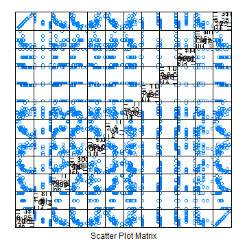

The miles per gallon (mpg) app
========================================================
author: glae
date: 16 October 2015

Why an mpg app ?
========================================================

These days it has become clear that the data provided by car manufacturers cannot always be trusted. Nevertheless when you need to buy a new car, fuel consumption is an important feature.

- The mpg predictor app predicts the expected mpg for a car based on some key features such as number of cylinders, horespower etc. 
- Not based on biased manufacturer data but on linear reqression model based on independent data provided by "1974 Motor Trend US magazine".
- Allows to quickly calculate the expected mpg for several cars to help you make your final choice.  

How to use the mpg app ?  
========================================================
- Input panel and output panel
- Help text at bottom of each panel  


How was the prediction model built ?
========================================================
- Exploratory analysis to select the predictors.    

 

- Code used to determine the model.  
<font size= "5">

```r
intrain = createDataPartition(mtcars$mpg, p = 4/5, list = FALSE)
train = mtcars[intrain,]
test = mtcars[-intrain,]
#cache modelfit in global environment so it can be reused
modelfit <<- train(train$mpg ~ cyl+hp+wt+am+gear, method="glm", data=train)
```
</font>
Limitations
========================================================
- Sample size of mtcars is too small , nbr of observations 
<font size= "5">

```
[1] 32
```
</font>
- So the model is overfitted to this sample
<font size= "5"> 

```r
# calculate the RMSE on training and test
TrainRMSE = sqrt(sum(modelfit$fitted- train$mpg)^2)
TestRMSE = sqrt(sum(predict(modelfit, newdata = test) - test$mpg)^2)
```
</font>
<font size= "5">

```
$TrainRMSE
[1] 0

$TestRMSE
[1] 6.70962
```
</font>
- Need more and more recent data !
